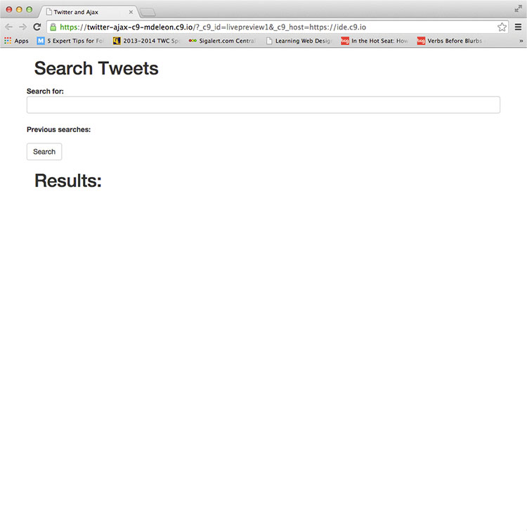
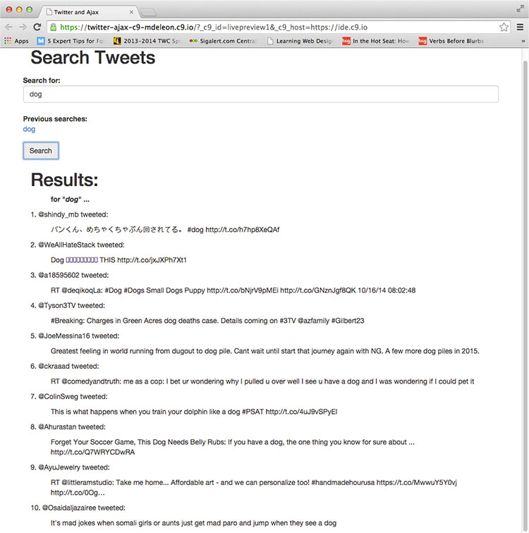
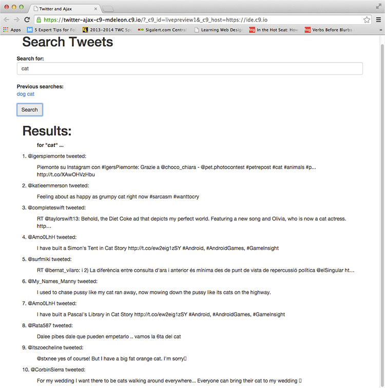
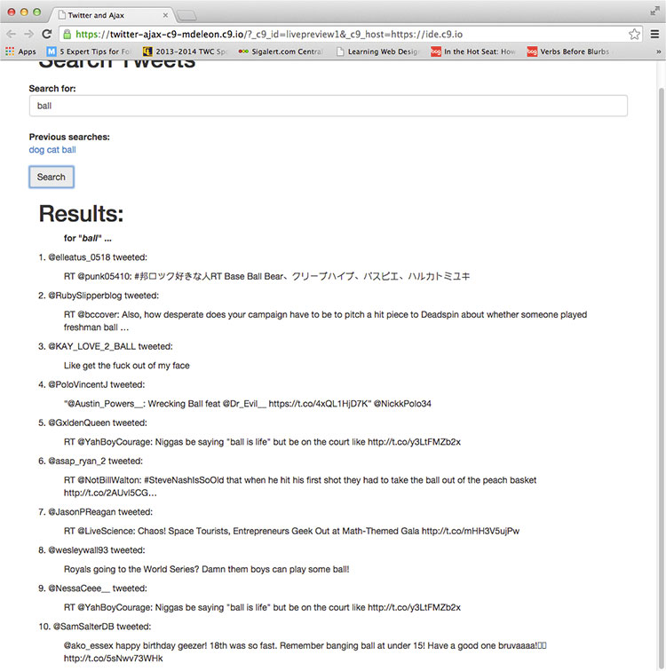

  
`School Work - Advanced Web Design Class - ITI-323`  

# Dates:  
2013 - 2014  
# Technologies:  
Cloud9, HTML5, CSS3, Bootstrap 3, AJAX, jQuery, Twitter API  
# Description:  
This assignment searches Twitter for search terms using Twitter REST API making AJAX calls to it and gives back the results.  History of previous searches are saved.  The webpage was created with HTML5, CSS3, Bootstrap 3, AJAX, jQuery and Twitter REST API in [Cloud9 - https://c9.io](https://c9.io/).  
# Screenshots:
  

  

  

  
